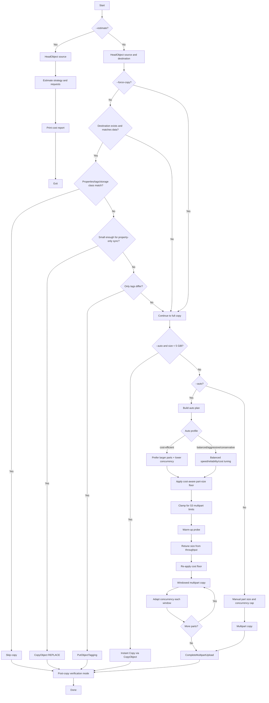

# S3 Large File Copy Tool

[](https://github.com/bartleboeuf/s3_largecopy/actions/workflows/release.yml)
[](LICENSE)

A Rust application for copying large files (>5GB) between Amazon S3 buckets using multipart upload with progress tracking.

## Little bit of history ...

I wrote this application due to a lack of tools and simplicity for moving large files between S3 buckets. Currently, AWS's simple copy object does not support objects larger than 5 GB in a single operation ([see official documentation](https://docs.aws.amazon.com/AmazonS3/latest/API/API_CopyObject.html)). Another solution available from AWS Support is to use a Python Lambda with S3 batch operations. Unfortunately, it takes hours and often fails after the 15-minute timeout for large files.
My goal was simple: I wanted a clean and simple command-line interface (CLI) that could do the job (**VERY**) fast, clean, and with a lot of tuning, options, and customization.
It is satisfying to see that the transfer of a single 100 GB file takes less than 30 seconds with a simple command line, from an EC2 instance in my VPC. 

## Features

### Core Capabilities
- **Smart Redundancy Check**: Automatically skips the copy if the destination already contains an identical file (uses Size + Persistent Identity Tracking)
- **Multipart Upload**: Efficiently copy large files using S3's multipart upload API
- **Advanced Performance**: High-concurrency engine (up to 1000 parallel parts) with optimized Hyper connection pools
- **Property Preservation**: Automatically copies standard metadata (`Content-Type`, `Cache-Control`, etc.) and S3 object tags from source to destination.
- **Auto-Tuning Mode**: Use `--auto` to automatically optimize part size, concurrency, and network settings. Includes an **Instant Copy** path for files < 5GB.
- **Adaptive Sizing**: Automatically scales part sizes for multi-terabyte files to stay within S3's 10,000-part limit.
- **Enhanced Progress**: Real-time dashboard showing throughput (MB/s), ETA, and overall completion.

### Enterprise Controls
- **Storage Class Support**: Target any S3 storage class (`STANDARD`, `INTELLIGENT_TIERING`, `GLACIER_IR`, `DEEP_ARCHIVE`, etc.)
- **Cross-Account ACL**: Optional `bucket-owner-full-control` ACL for cross-account copies (`--full-control`, disable with `--no-acl`)
- **Granular Control Flags**: Selectively disable metadata (`--no-metadata`), tags (`--no-tags`), storage class (`--no-storage-class`), or ACL replication

### Security & Integrity
- **KMS/Encryption Support**: Server-side encryption with S3-managed keys (`--sse AES256`) or customer-managed KMS keys (`--sse aws:kms --sse-kms-key-id <key>`)
- **Checksum Validation**: Advanced integrity verification with CRC32, CRC32C, SHA1, or SHA256 checksums (`--checksum-algorithm`)
- **Dry Run Mode**: Simulate the entire copy operation without modifying any data (`--dry-run`)

### Cost Management
- **Cost Estimation**: Get detailed cost breakdowns before executing a copy (`--estimate`)
  - Region-aware pricing for 19+ AWS regions
  - Accurate API request costs (PUT/COPY/GET class)
  - Cross-region data transfer calculations
  - Monthly storage cost projections by storage class
  - Auto-tuning aware (mirrors actual part-size selection)

### Reliability & Portability
- **Error Handling**: Automatic fail-safe cleanup via `abort_multipart_upload` on any transfer error
- **Force Overwrite**: Use `--force-copy` to overwrite destination even when redundancy checks would normally skip copy
- **Statically Linked**: Optimized for portability with musl-libc (no local GLIBC dependencies)
- **Quiet Mode**: Silent operation for cron jobs and automation (`--quiet`)


## Prerequisites

- Rust 1.93.0 or later
- AWS credentials configured (via `aws configure` or environment variables)
- Sufficient permissions on source and destination buckets

## Installation

### Standard Build (requires matching GLIBC version)

```bash
# Clone or navigate to the project directory
cd s3_largecopy

# Build the project
cargo build --release

# The binary will be at target/release/s3_largecopy
```

### Static Binary Build (recommended for portability)

The static binary works on any Linux server regardless of GLIBC version.

**Using Docker (recommended):**

```bash
# Build static binary using Docker
docker run --rm \
  -v "$(pwd)":/appli/aws/s3_largecopy \
  -w /appli/aws/s3_largecopy \
  rust:1.93-alpine \
  sh -c "apk add musl-dev perl make && rustup target add x86_64-unknown-linux-musl && cargo build --release --target x86_64-unknown-linux-musl"

# The static binary will be at:
# target/x86_64-unknown-linux-musl/release/s3_largecopy
```

**Or use the build script:**

```bash
chmod +x build_static_docker.sh
./build_static_docker.sh
```

The static binary is located at: `target/x86_64-unknown-linux-musl/release/s3_largecopy`

**Verify it's static:**
```bash
file target/x86_64-unknown-linux-musl/release/s3_largecopy
# Should show: "statically linked" or "static-pie linked"
```

## Usage

### Basic Usage

```bash
# Copy a file between buckets
./target/release/s3_largecopy \
    -s my-source-bucket \
    -k path/to/large-file.iso \
    -b my-dest-bucket \
    -t path/to/copy/large-file.iso
```

### With Custom Part Size and Concurrency

```bash
# Copy with 256MB parts and 50 concurrent uploads
./target/release/s3_largecopy \
    -s my-source-bucket \
    -k path/to/large-file.iso \
    -b my-dest-bucket \
    -t path/to/copy/large-file.iso \
    -p 256 \
    --concurrency 50
```

### With Specific AWS Region

```bash
# Copy between buckets in a specific region
./target/release/s3_largecopy \
    -s my-source-bucket \
    -k path/to/large-file.iso \
    -b my-dest-bucket \
    -t path/to/copy/large-file.iso \
    -r us-west-2
```

### Advanced Usage Examples

#### Auto-Tuning Mode
Let the tool automatically decide the best part size and concurrency based on file size.

```bash
./target/release/s3_largecopy \
    -s source-bucket -k heavy-file.csv \
    -b dest-bucket -t heavy-file.csv \
    --auto
```

#### Auto-Tuning (Cost-Efficient Profile)
Prioritize lower multipart API request count with larger parts.

```bash
./target/release/s3_largecopy \
    -s source-bucket -k heavy-file.csv \
    -b dest-bucket -t heavy-file.csv \
    --auto \
    --auto-profile cost-efficient
```

#### Changing Storage Class
Copy data to a cheaper storage class like Intelligent Tiering or Glacier Deep Archive.

```bash
./target/release/s3_largecopy \
    -s source-bucket -k archive.zip \
    -b dest-bucket -t archive.zip \
    --storage-class INTELLIGENT_TIERING
```

#### Cross-Account Copy (ACLs)
When copying to another account's bucket, you often need to grant them full control.

```bash
./target/release/s3_largecopy \
    -s source-bucket -k shared-data.bin \
    -b external-account-bucket -t shared-data.bin \
    --full-control
```

#### Metadata Control
Skip copying tags or custom metadata headers.

```bash
./target/release/s3_largecopy \
    -s source-bucket -k raw-data.dat \
    -b dest-bucket -t raw-data.dat \
    --no-tags --no-metadata
```

#### Data Integrity (Checksums)
Enable additional checksum validation (CRC32, CRC32C, SHA1, or SHA256) during transfer.

```bash
./target/release/s3_largecopy \
    -s source-bucket -k critical-backup.db \
    -b dest-bucket -t critical-backup.db \
    --checksum-algorithm SHA256
```

#### Server-Side Encryption (KMS)
Encrypt the destination object using a specific KMS key (AWS managed or customer managed).

```bash
./target/release/s3_largecopy \
    -s source-bucket -k sensitive-data.csv \
    -b dest-bucket -t sensitive-data.csv \
    --sse aws:kms \
    --sse-kms-key-id alias/my-key
```

#### Dry Run Simulation
See exactly what will happen without actually moving any data.

```bash
./target/release/s3_largecopy \
    -s source-bucket -k test-file.iso \
    -b dest-bucket -t test-file.iso \
    --dry-run
```

#### Force Overwrite
Always copy and overwrite destination object, even if destination already matches source.

```bash
./target/release/s3_largecopy \
    -s source-bucket -k file.bin \
    -b dest-bucket -t file.bin \
    --force-copy
```

#### Quiet Mode
Run silently (useful for cron jobs or scripts).

```bash
./target/release/s3_largecopy \
    -s source-bucket -k daily-log.txt \
    -b dest-bucket -t daily-log.txt \
    --quiet
```

#### Cost Estimation
Get a detailed cost breakdown before running a copy. Supports cross-region estimation.

```bash
# Same-region estimate
./target/release/s3_largecopy \
    -s source-bucket -k large-dataset.tar.gz \
    -b dest-bucket -t large-dataset.tar.gz \
    -r us-east-1 \
    --estimate

# Cross-region estimate with a different storage class
./target/release/s3_largecopy \
    -s source-bucket -k large-dataset.tar.gz \
    -b dest-bucket -t large-dataset.tar.gz \
    -r us-east-1 \
    --dest-region eu-west-1 \
    --storage-class INTELLIGENT_TIERING \
    --estimate
```

## Command Line Options

| Option | Short | Description | Default |
|--------|-------|-------------|---------|
| `--source-bucket` | `-s` | Source S3 bucket name | Required |
| `--source-key` | `-k` | Source object key | Required |
| `--dest-bucket` | `-b` | Destination S3 bucket name | Required |
| `--dest-key` | `-t` | Destination object key | Required |
| `--region` | `-r` | AWS region | Default provider |
| `--part-size` | `-p` | Part size in MB (5-5120) | 256 |
| `--concurrency` |  | Number of concurrent uploads (1-1000) | 50 |
| `--storage-class` |  | Target storage class (`STANDARD`, `INTELLIGENT_TIERING`, etc.) | Source/default |
| `--full-control` |  | Apply `bucket-owner-full-control` ACL | `false` |
| `--auto` | | Enable automatic transfer tuning | `false` |
| `--auto-profile` | | Auto mode profile (`balanced`, `aggressive`, `conservative`, `cost-efficient`) | `balanced` |
| `--no-metadata` | | Disable replication of metadata headers | `false` |
| `--no-tags` | | Disable replication of S3 object tags | `false` |
| `--no-storage-class` | | Use destination default storage class | `false` |
| `--no-acl` | | Disable `bucket-owner-full-control` ACL | `false` |
| `--dry-run` | | Simulate the copy without modifying data | `false` |
| `--force-copy` | | Always overwrite destination (disable skip/property-only shortcuts) | `false` |
| `--verify-integrity` | | Verification mode (`off`, `etag`, `checksum`) | `etag` |
| `--checksum-algorithm` | | Checksum algorithm (CRC32, CRC32C, SHA1, SHA256) | None |
| `--sse` | | Server-side encryption algorithm (AES256, aws:kms) | None |
| `--sse-kms-key-id` | | KMS Key ID (ARN or Alias) for aws:kms | None |
| `--estimate` | | Print a detailed cost estimate and exit | `false` |
| `--dest-region` | | Destination region (for cross-region cost estimate) | Same as `--region` |
| `--quiet` | `-q` | Suppress all informational output | `false` |

## Architecture

The following diagram illustrates the application's decision-making process for optimizing transfers:




## How It Works

1.  **Metadata Discovery**: Fetches source metadata first, and destination metadata unless `--force-copy` is enabled.
2.  **Identity/Property Shortcuts**: If destination data matches source, it can skip copy or run property/tag-only sync instead of full data copy.
3.  **Force Overwrite Path**: `--force-copy` bypasses shortcut checks and always performs a full overwrite copy.
4.  **Auto-Tuning Engine**: With `--auto`, the tool can use Instant Copy for files `< 5 GiB`, otherwise it picks profile-based part size/concurrency, region-aware limits, and adaptive sizing.
5.  **Cost Optimization**: Auto mode applies a cost-aware part-size floor to reduce multipart request count while keeping performance tuning.
6.  **Probe + Adaptive Loop**: A warm-up probe measures throughput, then multipart copy runs in windows with dynamic concurrency adjustment.
7.  **Integrity Verification**: Post-copy verification uses `--verify-integrity` (`off`, `etag`, or `checksum`).
8.  **Fail-Safe Cleanup**: Interrupted multipart uploads are aborted via `AbortMultipartUpload` to prevent hidden costs.

### Part Size Guidelines

- **Minimum**: 5 MB
- **Maximum**: 5 GB
- **Default**: 256 MB
- **Adaptive**: The tool will automatically increase this if `file_size / part_size > 10,000` to comply with S3 limits.

## AWS Permissions Required

The AWS credentials must have the following permissions:

**Source Bucket:**
- `s3:GetObject` - Read the source object

**Destination Bucket:**
- `s3:CreateMultipartUpload` - Start multipart upload
- `s3:UploadPartCopy` - Copy parts from source
- `s3:CompleteMultipartUpload` - Finish upload
- `s3:AbortMultipartUpload` - Cleanup on failure
- `s3:PutObject` - Write the destination object

### IAM Policy Example

```json
{
    "Version": "2012-10-17",
    "Statement": [
        {
            "Sid": "SourceBucketPermissions",
            "Effect": "Allow",
            "Action": [
                "s3:GetObject",
                "s3:GetObjectAttributes",
                "s3:GetObjectTagging"
            ],
            "Resource": "arn:aws:s3:::source-bucket/*"
        },
        {
            "Sid": "DestBucketPermissions",
            "Effect": "Allow",
            "Action": [
                "s3:PutObject",
                "s3:PutObjectTagging",
                "s3:PutObjectAcl",
                "s3:CreateMultipartUpload",
                "s3:UploadPartCopy",
                "s3:CompleteMultipartUpload",
                "s3:AbortMultipartUpload",
                "s3:ListMultipartUploadParts"
            ],
            "Resource": "arn:aws:s3:::dest-bucket/*"
        },
        {
            "Sid": "KMSPermissions",
            "Effect": "Allow",
            "Action": [
                "kms:Decrypt",
                "kms:GenerateDataKey"
            ],
            "Resource": "arn:aws:kms:region:account:key/key-id"
        }
    ]
}
```
*Note: KMS permissions are only required if using `--sse aws:kms`.*

## Error Handling

- **Network Failures**: Failed parts can be retried (the application handles this automatically with concurrent uploads)
- **Incomplete Uploads**: Automatically aborted on failure to avoid charges
- **Size Mismatch**: Warning displayed if source and destination sizes differ

## Performance Tips

1. **Increase Part Size**: For files > 100GB, use 500MB-1GB parts
2. **Increase Concurrency**: For high-bandwidth connections, increase `--concurrency`
3. **Use Same Region**: Copying within the same region is faster
4. **Check Network**: Ensure good network connectivity to AWS

## Troubleshooting

### "Access Denied" Errors
- Verify IAM permissions for both source and destination buckets
- Check bucket policies that might restrict access

### "No Such Upload" Errors
- The upload might have been aborted due to timeout
- Try again with a fresh copy

### Slow Performance
- Increase `--part-size` to reduce API calls
- Increase `--concurrency` for parallel uploads
- Check your network bandwidth to AWS

## Documentation

- [Auto Mode Guide](docs/AUTO_MODE.md)
- [Cost Analysis](docs/COST_ANALYSIS.md)

## What's next?

Here are some ideas I have for the next features to implement are in the [FUTURE_FEATURES.md](FUTURE_FEATURES.md) file.

## License

MIT License

## Contributing

Contributions are welcome! Please feel free to submit a Pull Request.
