# S3 Large File Copy Tool

A Rust application for copying large files (>5GB) between Amazon S3 buckets using multipart upload with progress tracking.

## Little bit of history ...

I wrote this application due to a lack of tools and simplicity for moving large files between S3 buckets. Currently, AWS's simple copy object does not support objects larger than 5 GB in a single operation ([see official documentation](https://docs.aws.amazon.com/AmazonS3/latest/API/API_CopyObject.html)). Another solution available from AWS Support is to use a Python Lambda with S3 batch operations. Unfortunately, it takes hours and often fails after the 15-minute timeout for large files.
My goal was simple: I wanted a clean and simple command-line interface (CLI) that could do the job (**VERY**) fast, clean, and with a lot of tuning, options, and customization.
It is satisfying to see that the transfer of a single 100 GB file takes less than 30 seconds with a simple command line, from an EC2 instance in my VPC. 

## Features

- **Smart Redundancy Check**: Automatically skips the copy if the destination already contains an identical file (uses Size + Persistent Identity Tracking)
- **Multipart Upload**: Efficiently copy large files using S3's multipart upload API
- **Advanced Performance**: High-concurrency engine (up to 1000 parallel parts) with optimized Hyper connection pools
- **Property Preservation**: Automatically copies standard metadata (`Content-Type`, `Cache-Control`, etc.) and S3 object tags from source to destination.
- **Auto-Tuning Mode**: Use `--auto` to automatically optimize part size, concurrency, and network settings. Includes an **Instant Copy** path for files < 5GB.
- **Enterprise Controls**: Support for custom storage classes (`INTELLIGENT_TIERING`, `GLACIER`, etc.) and cross-account `bucket-owner-full-control` ACL.
- **Adaptive Sizing**: Automatically scales part sizes for multi-terabyte files to stay within S3's 10,000-part limit.
- **Enhanced Progress**: Real-time dashboard showing throughput (MB/s), ETA, and overall completion.
- **Error Handling**: Automatic fail-safe cleanup via `abort_multipart_upload` on any transfer error.
- **Statically Linked**: Optimized for portability with musl-libc (no local GLIBC dependencies).

## Prerequisites

- Rust 1.93.0 or later
- AWS credentials configured (via `aws configure` or environment variables)
- Sufficient permissions on source and destination buckets

## Installation

### Standard Build (requires matching GLIBC version)

```bash
# Clone or navigate to the project directory
cd s3_largecopy

# Build the project
cargo build --release

# The binary will be at target/release/s3_largecopy
```

### Static Binary Build (recommended for portability)

The static binary works on any Linux server regardless of GLIBC version.

**Using Docker (recommended):**

```bash
# Build static binary using Docker
docker run --rm \
  -v "$(pwd)":/appli/aws/s3_largecopy \
  -w /appli/aws/s3_largecopy \
  rust:1.93-alpine \
  sh -c "apk add musl-dev perl make && rustup target add x86_64-unknown-linux-musl && cargo build --release --target x86_64-unknown-linux-musl"

# The static binary will be at:
# target/x86_64-unknown-linux-musl/release/s3_largecopy
```

**Or use the build script:**

```bash
chmod +x build_static_docker.sh
./build_static.sh
```

The static binary is located at: `target/x86_64-unknown-linux-musl/release/s3_largecopy`

**Verify it's static:**
```bash
file target/x86_64-unknown-linux-musl/release/s3_largecopy
# Should show: "statically linked" or "static-pie linked"
```

## Usage

### Basic Usage

```bash
# Copy a file between buckets
./target/release/s3_largecopy \
    -s my-source-bucket \
    -k path/to/large-file.iso \
    -b my-dest-bucket \
    -t path/to/copy/large-file.iso
```

### With Custom Part Size and Concurrency

```bash
# Copy with 200MB parts and 5 concurrent uploads
./target/release/s3_largecopy \
    -s my-source-bucket \
    -k path/to/large-file.iso \
    -b my-dest-bucket \
    -t path/to/copy/large-file.iso \
    -p 256 \
    --concurrency 50
```

### With Specific AWS Region

```bash
# Copy between buckets in a specific region
./target/release/s3_largecopy \
    -s my-source-bucket \
    -k path/to/large-file.iso \
    -b my-dest-bucket \
    -t path/to/copy/large-file.iso \
    -r us-west-2
```

## Command Line Options

| Option | Short | Description | Default |
|--------|-------|-------------|---------|
| `--source-bucket` | `-s` | Source S3 bucket name | Required |
| `--source-key` | `-k` | Source object key | Required |
| `--dest-bucket` | `-d` | Destination S3 bucket name | Required |
| `--dest-key` | `-t` | Destination object key | Required |
| `--region` | `-r` | AWS region | Default provider |
| `--part-size` | `-p` | Part size in MB (5-5120) | 256 |
| `--concurrency` | `-c` | Number of concurrent uploads (1-1000) | 50 |
| `--auto` | | Enable automatic transfer tuning | `false` |
| `--no-metadata` | | Disable replication of metadata headers | `false` |
| `--no-tags` | | Disable replication of S3 object tags | `false` |
| `--no-storage-class` | | Use destination default storage class | `false` |
| `--no-acl` | | Disable `bucket-owner-full-control` ACL | `false` |
| `--quiet` | `-q` | Suppress all informational output | `false` |

## Architecture

The following diagram illustrates the application's decision-making process for optimizing transfers:

```mermaid
graph TD
    Start[Start S3 Copy] --> FetchMeta[Fetch Source & Dest Metadata]
    FetchMeta --> IdentityCheck{Data Identities Match?}
    
    IdentityCheck -->|Yes| PropertyCheck{Metadata, Tags, SC Match?}
    IdentityCheck -->|No| AdaptiveSize[Calculate Adaptive Part Size]

    PropertyCheck -->|Yes| Skip[⏭️ Skip Copy]
    PropertyCheck -->|No| SizeLimit{Size <= 5GB?}

    SizeLimit -->|Yes| CopyObj[🔄 CopyObject REPLACE]
    SizeLimit -->|No| OnlyTags{Only Tags Diff?}
    
    OnlyTags -->|Yes| PutTags[🔄 PutObjectTagging]
    OnlyTags -->|No| Multipart[🔄 Multipart Copy]

    AdaptiveSize --> Multipart
    CopyObj --> Complete[✨ Success]
    PutTags --> Complete
    Multipart --> ParallelCopy[📤 Parallel UploadPartCopy]
    ParallelCopy --> Complete
```



## How It Works

1.  **Metadata Discovery**: The tool fetches metadata and tagging for both the source and the destination object.
2.  **Identity Verification**: It compares the file size and searches for the `x-amz-meta-source-etag` header on the destination. This persistent "Identity Tracking" allows skipping or syncing objects even when S3's own ETag changes.
3.  **Intelligent Syncing**:
    *   **Skip**: If data and properties (metadata, tags, storage class) match exactly.
    *   **Property-Only Sync**: If data matches but properties differ, it updates them WITHOUT re-uploading the data. It uses `CopyObject` (REPLACE) for small files (<5GB) or `PutObjectTagging` for larger ones if only tags changed.
4.  **Adaptive Scaling**: For objects > 2.5TB, the tool scales the `part_size` up to stay within S3's 10,000-part limit (supporting up to 50TB).
5.  **Auto-Tuning Engine**: When `--auto` is enabled, the tool dynamically selects the best part size (128MB to 1GB) and concurrency (up to 100) based on the object size. It also optimizes the internal connection pool and retry strategy.
6.  **High-Concurrency Engine**: A semaphore-limited async pool executes `UploadPartCopy` operations in parallel using a custom-tuned Hyper HTTP/2 connector.
7.  **Fail-Safe Cleanup**: Interrupted uploads are automatically aborted via `AbortMultipartUpload` to prevent hidden costs.

### Part Size Guidelines

- **Minimum**: 5 MB
- **Maximum**: 5 GB
- **Default**: 256 MB
- **Adaptive**: The tool will automatically increase this if `file_size / part_size > 10,000` to comply with S3 limits.

## AWS Permissions Required

The AWS credentials must have the following permissions:

**Source Bucket:**
- `s3:GetObject` - Read the source object

**Destination Bucket:**
- `s3:CreateMultipartUpload` - Start multipart upload
- `s3:UploadPartCopy` - Copy parts from source
- `s3:CompleteMultipartUpload` - Finish upload
- `s3:AbortMultipartUpload` - Cleanup on failure
- `s3:PutObject` - Write the destination object

### IAM Policy Example

```json
{
    "Version": "2012-10-17",
    "Statement": [
        {
            "Effect": "Allow",
            "Action": [
                "s3:GetObject"
            ],
            "Resource": "arn:aws:s3:::source-bucket/*"
        },
        {
            "Effect": "Allow",
            "Action": [
                "s3:CreateMultipartUpload",
                "s3:UploadPartCopy",
                "s3:CompleteMultipartUpload",
                "s3:AbortMultipartUpload",
                "s3:PutObject"
            ],
            "Resource": "arn:aws:s3:::dest-bucket/*"
        }
    ]
}
```

## Error Handling

- **Network Failures**: Failed parts can be retried (the application handles this automatically with concurrent uploads)
- **Incomplete Uploads**: Automatically aborted on failure to avoid charges
- **Size Mismatch**: Warning displayed if source and destination sizes differ

## Performance Tips

1. **Increase Part Size**: For files > 100GB, use 500MB-1GB parts
2. **Increase Concurrency**: For high-bandwidth connections, increase `--concurrency`
3. **Use Same Region**: Copying within the same region is faster
4. **Check Network**: Ensure good network connectivity to AWS

## Troubleshooting

### "Access Denied" Errors
- Verify IAM permissions for both source and destination buckets
- Check bucket policies that might restrict access

### "No Such Upload" Errors
- The upload might have been aborted due to timeout
- Try again with a fresh copy

### Slow Performance
- Increase `--part-size` to reduce API calls
- Increase `--concurrency` for parallel uploads
- Check your network bandwidth to AWS


## What's next?

Here are some ideas for the next features to implement:

- [ ] Synchronize the full path and not just the objects individually.
- [ ] Cross-Region optimizations.
- [ ] Cross-Partition support.

## License

MIT License

## Contributing

Contributions are welcome! Please feel free to submit a Pull Request.