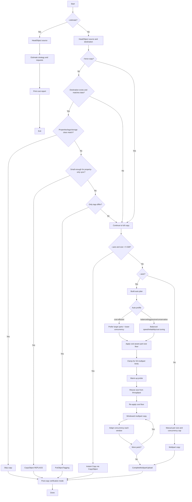
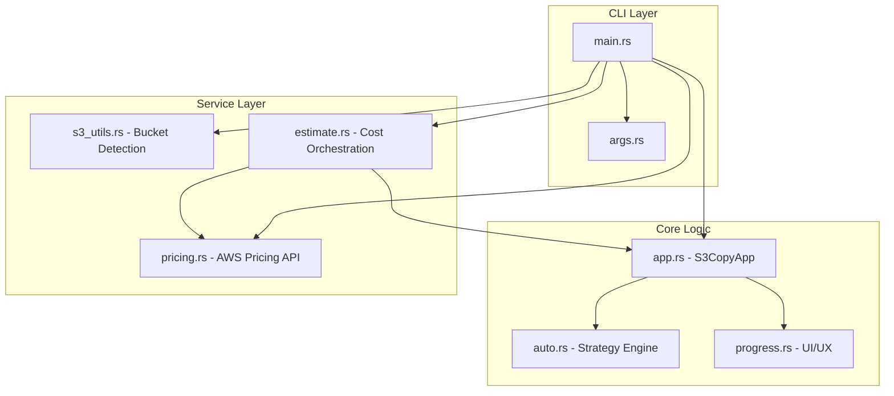

# Architecture and How It Works

This document details the internal logic and architecture of the S3 Large File Copy Tool.

## Decision Flow

The application follows a complex decision process to ensure efficiency and data integrity:

## Internal Architecture

The application is structured into modular layers for maintainability:

### Module Descriptions
- **`app.rs`**: The primary state machine. Coordinates the multipart upload lifecycle.
- **`auto.rs`**: The "brain" of the tool. Calculates part sizes, throughput-based adjustments, and adaptive concurrency.
- **`pricing.rs`**: Fetches real-time cost data from the AWS Price List API.
- **`estimate.rs`**: Logic for dry-run cost projections.
- **`progress.rs`**: Handles the terminal UI and throughput statistics.

## Part Size Guidelines

- **Min size**: 5 MB (S3 requirement)
- **Max size**: 5 GB per part
- **Max parts**: 10,000 per object
- **Adaptive behavior**: If the file size exceeds ~2.5 TB with the default 256 MB parts, the tool automatically grows the part size to remain under the 10,000-part limit.
