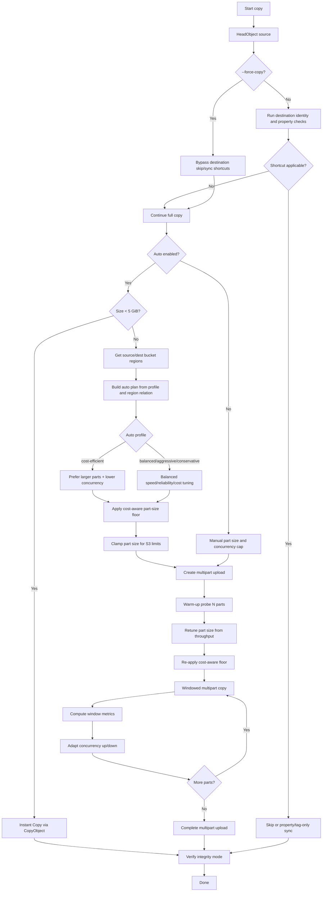

# Auto Mode Concept (`--auto`)

This document explains the Auto Mode behavior in `s3_largecopy` and how decisions are made during copy execution.

## Goal

Auto Mode chooses a copy strategy and transfer parameters dynamically to improve:
- throughput
- reliability
- S3 limit safety (10,000 multipart limit)
- one-time API request cost (fewer multipart requests when possible)
- verification confidence

## Main Inputs

- object size
- source/destination region relation (same-region or cross-region)
- auto profile: `balanced`, `aggressive`, `conservative`, `cost-efficient`
- CLI hard cap: `--concurrency`
- integrity mode: `--verify-integrity off|etag|checksum`

## Runtime Behavior Summary

1. Read source object metadata.
2. If `--force-copy` is enabled, skip destination identity/property shortcuts and always perform an overwrite copy.
3. If `size < 5 GiB` and `--auto` is enabled, use **Instant Copy** (`CopyObject`).
4. Otherwise:
- Build an initial plan (part size, initial concurrency, max concurrency).
- Apply a cost-aware part-size floor (to reduce `UploadPartCopy` request count).
- Clamp part size to keep total parts under S3 limits.
- Start multipart upload.
- Run a warm-up probe (few parts) to measure throughput.
- Retune part size from probe results.
- Re-apply cost floor after probe retune (so tuning does not increase request count too much).
- Copy remaining parts in windows.
- Adapt concurrency up/down based on observed window metrics.
- Complete multipart upload.
5. Run post-copy verification according to integrity mode.

## Auto Profiles

- `aggressive`: starts higher concurrency, ramps faster.
- `balanced`: default tradeoff between speed and stability.
- `conservative`: lower concurrency and gentler adjustments.
- `cost-efficient`: minimizes multipart request count first (larger parts, lower concurrency).

Cost behavior also depends on profile:
- `aggressive`: allows more parts (optimizes speed first).
- `balanced`: keeps part count moderate for better cost/perf balance.
- `conservative`: targets fewer parts to reduce API request cost.
- `cost-efficient`: targets the fewest parts practical (close to S3 max part size when needed).

## Verification Modes

- `off`: skip verification.
- `etag`: verify size and ETag/source-etag consistency.
- `checksum`: verify size plus checksum headers (fails if unavailable).

## Estimate Mode Alignment

`--estimate` uses the same auto-policy logic (instant copy decision, part sizing, multipart count) so predicted strategy stays consistent with runtime behavior.

## Decision Flow Diagram

## Key Design Notes

- Concurrency is treated as a **cap**; Auto Mode selects and adapts a runtime target within that cap.
- Part-size tuning always applies safety clamping to avoid exceeding multipart limits.
- Probe + adaptation makes behavior responsive to real network conditions instead of static thresholds only.

## Why do you see `50` max concurrency?

`50` is **not** an AWS S3 API hard limit.

In this project, `50` is the local default (`DEFAULT_CONCURRENCY`) used when `--concurrency` is not provided. The hard cap implemented by the tool is `1000` (`MAX_CONCURRENT_PARTS`), which is an application guardrail, not an S3 quota.

AWS S3 docs define multipart limits such as:
- part size: `5 MiB` to `5 GiB` (except last part)
- max parts per upload: `10,000`

AWS docs do **not** define a fixed “max parallel UploadPart/UploadPartCopy requests per upload” limit. S3 scales request rates, and during ramp-up you can see `503 Slow Down`, which is why Auto Mode adapts concurrency dynamically.

Official references (checked):
- Multipart limits: https://docs.aws.amazon.com/AmazonS3/latest/userguide/qfacts.html
- UploadPartCopy API reference: https://docs.aws.amazon.com/AmazonS3/latest/API/API_UploadPartCopy.html
- S3 performance scaling guidance: https://docs.aws.amazon.com/AmazonS3/latest/userguide/optimizing-performance.html
- Performance design patterns for Amazon S3: https://docs.aws.amazon.com/AmazonS3/latest/userguide/optimizing-performance-design-patterns.html

## Cost Optimization in Auto Mode

For multipart copies, one-time API cost is strongly driven by the number of `UploadPartCopy` requests:
- one part = one `UploadPartCopy` request
- more parts = more request charges

Auto Mode now applies a **cost-aware part-size floor**:
- compute a target max part count from `auto_profile` + region relation
- increase part size when needed to stay near/below that target
- still respect S3 limits (`5 MiB` min, `5 GiB` max per part, `10,000` max parts)

This reduces request count (and request cost) without removing throughput adaptation:
- warm-up probe can tune size for performance
- cost floor is re-applied after probe retune
- final part size remains bounded by S3 constraints

## Why Auto Mode does not always maximize part size

Auto Mode does not always push part size to `5 GiB` because its default goal is **balanced optimization**, not request-cost-only optimization.

Always maximizing part size would reduce `UploadPartCopy` request count, but it also has tradeoffs:
- less parallelism available for fast links
- larger retry blast radius (one failed part means re-copying a very large chunk)
- worse tail latency when only a few very large parts remain

To address this, Auto Mode uses profile-based behavior:
- `balanced` / `aggressive` / `conservative`: optimize across speed, reliability, and cost
- `cost-efficient`: prioritize lower request count and larger parts

Use `--auto-profile cost-efficient` when minimizing API request cost is your primary objective.
